# 02 — Database Schema & ER Diagram

## 2.1 Design principles

1. **Base table + `*_translations` child** for every content type that has
   TR/EN prose. The base row holds locale-neutral facts (dates, flags, order,
   slugs, foreign keys); the translation row holds language-specific text.
2. **Structured over free-form.** Repeatable QA artifacts (test scenarios, bug
   reports, API examples, SQL examples) are **typed rows with typed columns**,
   not a single JSON/HTML blob. Long-form prose (overview, challenges, impact,
   lessons) is **Markdown text**, sanitised on render.
3. **Normalise the taxonomy.** `project_platforms`, `project_tools`,
   `project_test_types`, industries → **one `taxonomy_terms` table + one
   `project_taxonomy` join**, discriminated by `kind`. (Rationale in §2.9.)
4. **No table per prose section.** `project_sections`, `project_challenges`,
   `project_impact`, `project_responsibilities` from the raw list are **not**
   separate tables — they are Markdown columns on `project_translations` or a
   single ordered `project_highlights` list. (Rationale in §2.9.)
5. **QA Lab reuses `projects`.** `qa_lab_projects` / `qa_lab_translations` are
   **not** separate tables; a QA Lab entry is a `projects` row with
   `classification = 'qa_lab'`. (Rationale in §2.9.)
6. **Publication state is data.** `status` + `visible` + `published_at` columns,
   enforced by RLS, not by the UI.
7. **Singletons are single rows** with a `CHECK (id = 1)` guard (`profile`,
   `site_settings`), each with its own `*_translations`.
8. Every table: `id uuid default gen_random_uuid()`, `created_at timestamptz`,
   `updated_at timestamptz` (trigger-maintained). Timestamps in UTC.

## 2.2 Table list (25 tables)

| Group | Tables |
|---|---|
| Identity & access | `admin_users` |
| Site / profile | `profile`, `profile_translations`, `site_settings`, `site_settings_translations`, `social_links` |
| Projects & case studies | `projects`, `project_translations`, `project_highlights`, `project_media`, `test_scenarios`, `test_scenario_translations`, `bug_reports`, `bug_report_translations`, `api_examples`, `api_example_translations`, `sql_examples`, `sql_example_translations` |
| Taxonomy | `taxonomy_terms`, `project_taxonomy` |
| Résumé modules | `experience`, `experience_translations`, `skill_categories`, `skills`, `services`, `service_translations`, `education`, `education_translations`, `certifications` |
| Media | `media`, `media_translations` |
| Contact | `contact_messages` |
| Audit | `content_audit` |

> Count note: the "25 tables" headline counts logical content types; the
> translation children push the physical count higher. The point of §2.1 is that
> this is the **minimum** that keeps the admin UX clean without a JSON swamp.

## 2.3 Enumerated types

```sql
create type locale                as enum ('tr','en');
create type content_status        as enum ('draft','published','archived');
create type project_classification as enum ('professional','supported','personal','qa_lab');
create type taxonomy_kind          as enum ('platform','tool','test_type','industry');
create type project_media_role     as enum ('cover','gallery','diagram','screenshot');
create type bug_severity           as enum ('blocker','critical','major','minor','trivial');
create type bug_state              as enum ('open','fixed','wont_fix','deferred','by_design');
create type http_method            as enum ('GET','POST','PUT','PATCH','DELETE');
create type test_priority          as enum ('p0','p1','p2','p3');
create type test_kind              as enum ('functional','regression','integration','e2e','api','performance','security','accessibility','exploratory');
create type employment_type        as enum ('full_time','part_time','contract','freelance','internship');
create type contact_state          as enum ('new','read','replied','archived','spam');
create type admin_role             as enum ('owner','editor');
```

## 2.4 Field definitions (key tables)

### `admin_users` — the authorization allow-list
| Column | Type | Notes |
|---|---|---|
| `user_id` | `uuid` PK | **FK → `auth.users(id)` ON DELETE CASCADE** |
| `role` | `admin_role` | default `'editor'`; exactly one `'owner'` expected in V1 |
| `display_name` | `text` | shown in the admin UI and audit log |
| `created_at` | `timestamptz` | |

`is_admin()` is defined against this table:
```sql
create function public.is_admin() returns boolean
language sql stable security definer set search_path = public as $$
  select exists (select 1 from public.admin_users where user_id = auth.uid());
$$;
```

### `profile` (singleton) / `profile_translations`
| `profile` | Type | Notes |
|---|---|---|
| `id` | `int` PK | `CHECK (id = 1)` |
| `full_name` | `text` | locale-neutral |
| `location` | `text` | e.g. `[PLACEHOLDER: City, Türkiye]` |
| `email_public` | `text` null | optional shown email |
| `phone_public` | `text` null | optional |
| `years_experience` | `int` null | |
| `available_for_work` | `boolean` | drives an "open to work" badge |
| `avatar_media_id` | `uuid` null | FK → `media(id)` |
| `resume_media_id` | `uuid` null | FK → `media(id)` (downloadable CV, per locale? see note) |
| `updated_at` | `timestamptz` | |

| `profile_translations` | Type | Notes |
|---|---|---|
| `id` | `uuid` PK | |
| `locale` | `locale` | **UNIQUE (`profile_id`,`locale`)** |
| `profile_id` | `int` FK → `profile(id)` | |
| `headline` | `text` | e.g. "Senior Software QA Engineer" |
| `bio_md` | `text` | Markdown |
| `summary_md` | `text` null | short version for hero / meta |
| `seo_title` | `text` null | |
| `seo_description` | `text` null | |

> Note: if the CV PDF differs per language, replace `resume_media_id` with
> `profile_translations.resume_media_id`. Flagged in
> [13](13-content-intake-checklist.md).

### `site_settings` (singleton) / `site_settings_translations`
| `site_settings` | Type | Notes |
|---|---|---|
| `id` | `int` PK | `CHECK (id = 1)` |
| `default_locale` | `locale` | default `'en'` `[PLACEHOLDER: confirm tr vs en]` |
| `contact_notification_email` | `text` | overrides env default if set |
| `analytics_id` | `text` null | |
| `feature_flags` | `jsonb` | small, typed in app code (e.g. `{ "qa_lab": true }`) |
| `primary_cta` | `text` null | `mailto:` / calendly `[PLACEHOLDER]` |

| `site_settings_translations` | Type | Notes |
|---|---|---|
| `locale` | `locale` | UNIQUE (`settings_id`,`locale`) |
| `site_title` | `text` | |
| `site_tagline` | `text` | |
| `meta_description` | `text` | default site-wide description |
| `og_image_media_id` | `uuid` null | default social image |

### `social_links` (not translatable)
`id uuid`, `platform text` (`github`/`linkedin`/`x`/`email`/`website`/…),
`label text`, `url text`, `display_order int`, `visible boolean`.

### `projects`
| Column | Type | Notes |
|---|---|---|
| `id` | `uuid` PK | |
| `slug` | `citext` UNIQUE | URL key, locale-neutral, immutable-after-publish (warn on change) |
| `classification` | `project_classification` | `professional` / `supported` / `personal` / `qa_lab` |
| `status` | `content_status` | `draft` / `published` / `archived` |
| `visible` | `boolean` | default `true`; `false` = temporarily hidden while published elsewhere |
| `featured` | `boolean` | default `false`; drives the home "Featured" rail |
| `supported` | `boolean` | default `false`; **derived-settable** — true iff `classification='supported'` (kept as a column for query speed + explicit control) |
| `display_order` | `int` | default `0`; manual ordering within a list |
| `company` | `text` null | employer / client; **nullable for NDA** |
| `company_hidden` | `boolean` | if true, render "Confidential" instead of `company` |
| `role_title` | `text` null | locale-neutral job title label (also localisable — see translations) |
| `start_date` | `date` null | |
| `end_date` | `date` null | |
| `is_ongoing` | `boolean` | |
| `nda` | `boolean` | gates which fields the public template renders |
| `github_url` | `text` null | |
| `external_url` | `text` null | live site / store listing |
| `cover_media_id` | `uuid` null | FK → `media(id)` |
| `published_at` | `timestamptz` null | set on first publish |
| `created_at` / `updated_at` | `timestamptz` | |

### `project_translations`
| Column | Type | Notes |
|---|---|---|
| `id` | `uuid` PK | |
| `project_id` | `uuid` FK | **UNIQUE (`project_id`,`locale`)**, ON DELETE CASCADE |
| `locale` | `locale` | |
| `title` | `text` | |
| `summary` | `text` | card + meta description |
| `role_title` | `text` null | localised role label |
| `overview_md` | `text` null | "what the project was" |
| `testing_scope_md` | `text` null | |
| `test_strategy_md` | `text` null | |
| `test_coverage_md` | `text` null | (can embed a small table in Markdown, or use `project_highlights`) |
| `challenges_md` | `text` null | replaces a `project_challenges` table |
| `impact_md` | `text` null | replaces a `project_impact` table |
| `lessons_md` | `text` null | "lessons learned" |
| `seo_title` | `text` null | |
| `seo_description` | `text` null | |
| `translation_status` | `content_status` | per-locale readiness (see §2.7) |

### `project_highlights` — one ordered list, not four tables
Replaces `project_responsibilities` + ad-hoc bullet sections.
| Column | Type | Notes |
|---|---|---|
| `id` | `uuid` PK | |
| `project_id` | `uuid` FK | |
| `locale` | `locale` | UNIQUE-ish: (`project_id`,`locale`,`kind`,`display_order`) |
| `kind` | `text` | `'responsibility'` / `'result'` / `'coverage'` — small controlled set in app |
| `text` | `text` | one bullet (short) |
| `display_order` | `int` | |

### `project_media`
`id uuid`, `project_id uuid FK`, `media_id uuid FK`, `role project_media_role`,
`display_order int`, `caption_tr text null`, `caption_en text null`.
(Captions inline here rather than a third translation table — they are short and
always edited alongside the gallery.)

### `test_scenarios` / `test_scenario_translations`
| `test_scenarios` | Type | Notes |
|---|---|---|
| `id uuid` PK | | |
| `project_id uuid` FK | | ON DELETE CASCADE |
| `code` | `text` | e.g. `TS-014` (display id, unique per project) |
| `priority` | `test_priority` | |
| `kind` | `test_kind` | |
| `automated` | `boolean` | |
| `display_order` | `int` | |

| `test_scenario_translations` | Type | |
|---|---|---|
| `locale locale` | UNIQUE (`scenario_id`,`locale`) | |
| `title text` | | |
| `preconditions_md text null` | | |
| `steps_md text` | Given/When or numbered steps | |
| `expected_md text` | | |
| `notes_md text null` | | |

### `bug_reports` / `bug_report_translations`
`bug_reports`: `id`, `project_id`, `code` (`BUG-003`), `severity bug_severity`,
`state bug_state`, `environment text null`, `found_in_version text null`,
`display_order int`.
`bug_report_translations`: `locale`, `title`, `summary_md`, `steps_md`,
`expected_md`, `actual_md`, `root_cause_md null`, `resolution_md null`.

### `api_examples` / `api_example_translations`
`api_examples`: `id`, `project_id`, `code` (`API-002`), `method http_method`,
`endpoint text`, `request_headers_json jsonb null`, `request_body text null`,
`response_status int null`, `response_body text null`, `display_order int`.
(Code / payloads are language-neutral and stored raw as text.)
`api_example_translations`: `locale`, `title`, `notes_md null` (what this call
demonstrates, in TR/EN).

### `sql_examples` / `sql_example_translations`
`sql_examples`: `id`, `project_id`, `code` (`SQL-001`), `dialect text`
(`postgres`/`mysql`/…), `query_sql text`, `sample_result text null`,
`display_order int`.
`sql_example_translations`: `locale`, `title`, `explanation_md null`.

### `taxonomy_terms` / `project_taxonomy`
| `taxonomy_terms` | Type | Notes |
|---|---|---|
| `id uuid` PK | | |
| `kind` | `taxonomy_kind` | `platform` / `tool` / `test_type` / `industry` |
| `slug` | `citext` | UNIQUE (`kind`,`slug`) |
| `label_tr` | `text` | |
| `label_en` | `text` | |
| `icon` | `text` null | icon key or media id |
| `display_order` | `int` | |
| `visible` | `boolean` | |

`project_taxonomy`: `project_id uuid FK`, `term_id uuid FK`,
**PK (`project_id`,`term_id`)**, `display_order int`.

### Résumé modules
- `experience`: `id`, `company`, `company_hidden boolean`, `location text null`,
  `start_date`, `end_date null`, `is_current boolean`, `employment_type`,
  `display_order`, `visible`, `nda boolean`.
  `experience_translations`: `locale`, `role_title`, `summary_md`,
  `highlights_md null`.
- `skill_categories`: `id`, `slug`, `label_tr`, `label_en`, `display_order`,
  `visible`.
- `skills`: `id`, `category_id FK`, `label text` (tool name, locale-neutral),
  `proficiency int` (1–5) `null`, `years int null`, `display_order`, `visible`,
  `featured boolean`. (No translation table — a localised one-line note can live
  in `feature_flags`-style app copy if ever needed; flagged as YAGNI.)
- `services`: `id`, `slug`, `icon text null`, `display_order`, `visible`.
  `service_translations`: `locale`, `title`, `description_md`, `outcome_md null`.
- `education`: `id`, `institution text`, `location text null`, `start_date`,
  `end_date null`, `display_order`, `visible`.
  `education_translations`: `locale`, `degree_title`, `field text null`,
  `notes_md null`.
- `certifications`: `id`, `name text`, `issuer text`, `issued_on date null`,
  `expires_on date null`, `credential_id text null`, `credential_url text null`,
  `badge_media_id uuid null`, `display_order`, `visible`.
  (Name/issuer are proper nouns — not translated. Optional `notes` could be
  added later.)

### `media` / `media_translations`
`media`: `id`, `bucket text` (default `'media'`), `storage_path text` UNIQUE,
`mime_type text`, `width int null`, `height int null`, `byte_size bigint`,
`checksum text` (sha256), `dominant_color text null`, `uploaded_by uuid FK →
auth.users`, `created_at`.
`media_translations`: `locale`, `alt_text text`, `caption text null`. UNIQUE
(`media_id`,`locale`). **`alt_text` required for at least the default locale**
(a11y + SEO gate).

### `contact_messages` (write-only from public)
`id uuid`, `name text`, `email text`, `subject text null`, `body text`,
`locale locale`, `page_path text null`, `ip_hash text` (salted hash, not the IP),
`user_agent text null`, `state contact_state` default `'new'`,
`spam_score numeric null`, `created_at timestamptz`.
No `updated_at` needed; `state` transitions are admin-only.

### `content_audit`
`id bigint generated always as identity`, `actor_user_id uuid null`,
`actor_name text`, `entity_type text`, `entity_id text`, `action text`
(`create`/`update`/`publish`/`unpublish`/`archive`/`restore`/`delete`/`reorder`/
`upload`), `summary text`, `created_at timestamptz`.

## 2.5 Primary keys & foreign keys (summary)

- All content PKs: `uuid` (`gen_random_uuid()`), except singletons (`int` = 1),
  `content_audit` (`bigint identity`).
- `admin_users.user_id` → `auth.users.id` (CASCADE).
- Every `*_translations.<parent>_id` → parent PK, **ON DELETE CASCADE**, with
  **`UNIQUE (<parent>_id, locale)`**.
- `projects` children (`project_translations`, `project_highlights`,
  `project_media`, `test_scenarios`, `bug_reports`, `api_examples`,
  `sql_examples`, `project_taxonomy`) → `projects.id` **ON DELETE CASCADE**.
- QA-artifact translations → their artifact (CASCADE).
- `*.*_media_id` → `media.id` **ON DELETE SET NULL** (deleting an image must not
  delete a project).
- `skills.category_id` → `skill_categories.id` (RESTRICT — can't delete a
  non-empty category).
- `project_taxonomy` composite PK `(project_id, term_id)`.

## 2.6 Relationships

```
auth.users ──1:1── admin_users
auth.users ──1:N── media (uploaded_by)

profile (1) ──1:N── profile_translations           [tr, en]
site_settings (1) ──1:N── site_settings_translations
site_settings (1) ──── social_links (N)  [conceptual grouping; social_links is standalone]

projects (1) ──1:N── project_translations          [tr, en]
projects (1) ──1:N── project_highlights
projects (1) ──1:N── project_media ──N:1── media
projects (1) ──1:N── test_scenarios ──1:N── test_scenario_translations
projects (1) ──1:N── bug_reports    ──1:N── bug_report_translations
projects (1) ──1:N── api_examples   ──1:N── api_example_translations
projects (1) ──1:N── sql_examples   ──1:N── sql_example_translations
projects (M) ──N:M via project_taxonomy── taxonomy_terms (N)   (kind ∈ platform|tool|test_type|industry)
projects.cover_media_id ──N:1── media

experience (1) ──1:N── experience_translations
skill_categories (1) ──1:N── skills
services (1) ──1:N── service_translations
education (1) ──1:N── education_translations
certifications  (standalone; badge_media_id ──N:1── media)

media (1) ──1:N── media_translations

contact_messages (standalone, write-only from anon)
content_audit    (standalone, append-only)
```

## 2.7 Translation strategy

- **Model:** base + `*_translations` keyed by `(parent_id, locale)`, `locale`
  enum = `('tr','en')`. Adding a third language later = adding an enum value, no
  schema change.
- **Fallback:** the app requests the active locale; if a translation row is
  missing or `translation_status <> 'published'`, it falls back to
  `site_settings.default_locale`. A project with no translation in *either*
  locale cannot be published (acceptance gate).
- **Per-locale readiness:** `project_translations.translation_status` lets the
  owner publish the EN case study while the TR one is still a draft — the public
  TR page then shows the EN content with a subtle "not yet translated" note, or
  (configurable) hides the project from the TR locale entirely.
- **UI chrome** (nav labels, button text, form labels, error messages) lives in
  `next-intl` message catalogs in the repo, **not** the database — it changes
  with code, not with content.
- **Slugs are locale-neutral** (one `projects.slug`). `hreflang` links
  `/tr/projects/{slug}` ↔ `/en/projects/{slug}`. (Alternative — localised slugs
  in `project_translations.slug` — is documented and **rejected** for V1: adds
  routing complexity and 404 edge cases for marginal SEO gain. Flagged OQ-006.)
- **Editor UX:** side-by-side TR | EN fields per section (see
  [05](05-admin-wireframes.md)), with a "copy TR → EN" helper and a
  completeness meter.

## 2.8 Publication strategy

| Mechanism | Column(s) | Public query condition |
|---|---|---|
| Lifecycle | `projects.status` | `= 'published'` |
| Temporary hide | `projects.visible` | `= true` |
| First-publish stamp | `projects.published_at` | used for ordering / "new" badge |
| Per-locale gate | `project_translations.translation_status` | `= 'published'` for the requested locale (else fallback rules) |
| Manual order | `display_order`, then `published_at desc` | `ORDER BY` |
| Featured rail | `projects.featured` | `= true` (home only) |

Transitions (admin server actions, each writes `content_audit` + revalidates):

```
draft ──publish──► published ──unpublish──► draft
      ◄─restore──            ──archive────► archived ──restore──► draft
published ──hide (visible=false)──► published/hidden ──show──► published
```

- **Archive ≠ delete.** Archived rows stay in the DB and in the admin UI,
  disappear from every public surface, and keep their audit trail.
- **Delete** is a separate, rarely used admin action (hard delete with a
  confirm + audit); cascades remove translations and artifacts.

## 2.9 Normalisation decisions (answering the raw table list)

| Raw list item | Decision | Rationale |
|---|---|---|
| `profiles` + `profile_translations` | **Keep** as `profile` (singleton) + `profile_translations` | One person; singleton avoids "which profile" bugs. |
| `projects` + `project_translations` | **Keep** | Core base+translation pattern. |
| `project_platforms`, `project_tools`, `project_test_types` | **Merge** → `taxonomy_terms` (kind) + `project_taxonomy` | Three near-identical (dimension table + join) structures collapse to one; the admin UI is one tag-picker with a `kind` filter; adding "industry" later is free. |
| `project_responsibilities` | **Fold** into `project_highlights` (kind='responsibility') | Short ordered bullets; a dedicated table + translation table is overkill. |
| `project_sections` | **Reject** as a generic table | The sections are a **fixed, known set** (overview, scope, strategy, coverage, challenges, impact, lessons). Fixed Markdown columns on `project_translations` are simpler to edit, validate and render than a generic ordered-section table. If truly free-form sections are needed later, add `project_sections` then. |
| `test_scenarios` | **Keep** (+ translations) | Repeatable, structured, filterable. |
| `bug_reports` | **Keep** (+ translations) | Repeatable, structured, has its own severity/state facets. |
| `api_examples` | **Keep**; translations only for `title`/`notes` | Payloads are language-neutral. |
| `sql_examples` | **Keep**; translations only for `title`/`explanation` | Query is language-neutral. |
| `project_challenges`, `project_impact` | **Reject** as tables → `challenges_md`, `impact_md` on `project_translations` | Prose, always one block, always edited with the case study. |
| `qa_lab_projects` + `qa_lab_translations` | **Reject** → `projects.classification = 'qa_lab'` | ~90% field overlap with `projects`. A lighter public template and a separate admin list view give the different UX without a duplicate schema and duplicate RLS. |
| `skills` + `skill_categories` | **Keep** both; no `skill_translations` | Tool names are proper nouns; category labels handled with `label_tr`/`label_en` inline columns (only two, always edited together). |
| `experience` + `experience_translations` | **Keep** | Role title + summary are localised. |
| `services` + `service_translations` | **Keep** | Descriptions are localised marketing copy. |
| `education` | **Keep** (+ translations for degree title/notes) | Institution is a proper noun; degree title benefits from localisation. |
| `certifications` | **Keep**, no translation table | Names/issuers are proper nouns; dates and URLs are neutral. |
| `media` + `social_links` + `site_settings` | **Keep**; `media` and `site_settings` get translation children for alt text / meta | Alt text and meta descriptions must be localised. |
| `admin_profiles` | **Reject** → `admin_users` (with `display_name`, `role`) | Redundant with `auth.users` + the allow-list; one table is enough. |

Net: the raw list of ~30 names becomes **~25 logical tables**, with the three
taxonomy tables and several "section" tables removed, and QA Lab de-duplicated —
while **no** content type is squeezed into a single JSON/HTML column.

## 2.10 RLS strategy

**Enable RLS on every table in `public`.** Default = deny.

### Helper
`public.is_admin()` (SECURITY DEFINER, §2.4).

### Read policies (public content)

For each **base** content table (`projects`, `experience`, `services`,
`education`, `certifications`, `skills`, `skill_categories`, `taxonomy_terms`,
`social_links`, `profile`, `site_settings`, `media`):

```sql
-- example: projects
create policy projects_public_read on projects
for select to anon, authenticated
using (
  status = 'published' and visible = true
  or public.is_admin()
);
```

For each **translation / child** table, the policy references the parent's
publication state:

```sql
create policy project_translations_public_read on project_translations
for select to anon, authenticated
using (
  public.is_admin()
  or exists (
    select 1 from projects p
    where p.id = project_translations.project_id
      and p.status = 'published' and p.visible = true
  )
);
```

`project_media`, `project_highlights`, `test_scenarios`(+translations),
`bug_reports`(+translations), `api_examples`(+translations),
`sql_examples`(+translations), `project_taxonomy` all use the same
"parent is published, or caller is admin" shape.

`media` read is public (images are served by URL anyway) but **`media` rows** in
listings still filter to admin unless referenced by published content — practical
approach: `media` SELECT `using (true)` for `anon` is acceptable because a bucket
URL is already public; the *admin media library listing* is gated in the app by
`is_admin()`. Documented trade-off, revisited in [10](10-security-plan.md).

### Write policies (all content tables)

```sql
create policy <table>_admin_write on <table>
for all to authenticated
using (public.is_admin())
with check (public.is_admin());
```

### `contact_messages`

```sql
alter table contact_messages enable row level security;

create policy contact_insert_anon on contact_messages
for insert to anon, authenticated
with check (true);           -- app adds honeypot + rate limit + validation

create policy contact_admin_read on contact_messages
for select to authenticated using (public.is_admin());

create policy contact_admin_update on contact_messages
for update to authenticated using (public.is_admin()) with check (public.is_admin());

-- no anon SELECT / UPDATE / DELETE policy => denied
```

A `BEFORE INSERT` trigger enforces a hard per-`ip_hash` cap (e.g. 5 / hour) as a
database-level backstop even if the app layer is bypassed.

### `content_audit`
`INSERT` allowed to `authenticated` where `is_admin()`; **no `UPDATE`/`DELETE`
policy** → append-only. `SELECT` where `is_admin()`.

### `admin_users`
`SELECT` where `is_admin()`. **No `INSERT`/`UPDATE`/`DELETE` policy** for any
app role — the allow-list is managed only via Supabase Studio / a migration by
the Human Founder (mirrors "access-control escalation" being a critical action).

### Storage (`storage.objects`, bucket `media`)
```sql
create policy media_public_read on storage.objects
for select to anon, authenticated using (bucket_id = 'media');

create policy media_admin_write on storage.objects
for insert to authenticated with check (bucket_id = 'media' and public.is_admin());

create policy media_admin_modify on storage.objects
for update to authenticated using (bucket_id = 'media' and public.is_admin());

create policy media_admin_delete on storage.objects
for delete to authenticated using (bucket_id = 'media' and public.is_admin());
```

### Service role
Bypasses RLS by design. Used only in `lib/supabase/admin-server.ts` for:
draft-preview reads, Storage cleanup jobs, and the initial seed. Never imported
by a client component (enforced by an ESLint `no-restricted-imports` rule + a
test).

## 2.11 Indexes (initial)

```sql
create index on projects (status, visible, classification, display_order);
create index on projects (featured) where featured;
create unique index on projects (slug);
create index on project_translations (project_id, locale);
create index on project_taxonomy (term_id);
create index on test_scenarios (project_id, display_order);
create index on bug_reports (project_id, display_order);
create index on contact_messages (state, created_at desc);
create index on content_audit (entity_type, entity_id, created_at desc);
-- trigram for simple project search
create extension if not exists pg_trgm;
create index on project_translations using gin (title gin_trgm_ops);
```

## 2.12 ER diagram (Mermaid)

```mermaid
erDiagram
  auth_users ||--o| admin_users : "allow-list"
  auth_users ||--o{ media : uploaded_by

  profile ||--o{ profile_translations : has
  site_settings ||--o{ site_settings_translations : has

  projects ||--o{ project_translations : has
  projects ||--o{ project_highlights : has
  projects ||--o{ project_media : has
  project_media }o--|| media : uses
  projects ||--o{ test_scenarios : has
  test_scenarios ||--o{ test_scenario_translations : has
  projects ||--o{ bug_reports : has
  bug_reports ||--o{ bug_report_translations : has
  projects ||--o{ api_examples : has
  api_examples ||--o{ api_example_translations : has
  projects ||--o{ sql_examples : has
  sql_examples ||--o{ sql_example_translations : has
  projects ||--o{ project_taxonomy : tagged
  taxonomy_terms ||--o{ project_taxonomy : tags
  projects }o--o| media : cover_media_id

  experience ||--o{ experience_translations : has
  skill_categories ||--o{ skills : groups
  services ||--o{ service_translations : has
  education ||--o{ education_translations : has
  certifications }o--o| media : badge_media_id

  media ||--o{ media_translations : has

  contact_messages }|..|| locale_enum : "written with locale"
  content_audit }o--o| auth_users : actor
```



## 2.13 Project data model — required capability matrix

| Capability (from spec) | Where it lives |
|---|---|
| Featured Project | `projects.featured = true` |
| Professional Project | `projects.classification = 'professional'` |
| Supported Project | `projects.classification = 'supported'` (`supported` bool mirrors it) |
| Personal Project | `projects.classification = 'personal'` |
| QA Lab Project | `projects.classification = 'qa_lab'` (lighter template + `/qa-lab` route) |
| Archived Project | `projects.status = 'archived'` |
| Draft / Published / Archived | `projects.status` enum |
| visible | `projects.visible` |
| featured | `projects.featured` |
| supported | `projects.supported` / `classification` |
| display_order | `projects.display_order` |
| TR content / EN content | `project_translations` (locale) + child artifact translations |
| NDA status | `projects.nda`, `projects.company_hidden`, `projects.company = null` |
| media | `project_media` + `media` + `projects.cover_media_id` |
| test content | `test_scenarios`, `bug_reports`, `api_examples`, `sql_examples` (+ their translations) + `*_md` fields on `project_translations` |

> **Spec contradiction handled here:** the raw spec lists *Featured* and
> *Archived* as both "project types" and as "status/flags". Resolution:
> `classification` = the kind of work (`professional`/`supported`/`personal`/
> `qa_lab`); `featured` = a boolean flag; `archived` = a `status` value. See
> [12](12-risks-open-questions.md) CONFLICT-01.
