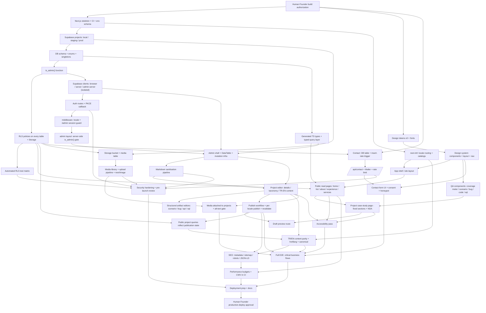

# 09 — Dependency Analysis

## 9.1 Critical-path dependency graph



## 9.2 The critical path (longest dependency chain)

```
build authorization
  → Next.js skeleton + CI
    → Supabase projects
      → DB schema
        → is_admin()
          → RLS policies
            → RLS test matrix
              → typed query layer  ┐
              → Supabase clients ──┤
                → auth + middleware + admin gate
                  → admin shell + mutation infra
                    → Markdown sanitisation
                      → project editor (TR/EN content)
                        → structured artifact editors
                          → publish workflow (+ revalidate)
                            → public queries reflect publication
                              → TR/EN parity + hreflang
                                → full E2E (project lifecycle + i18n)
                                  → deployment prep
                                    → Human Founder approval
```

Everything that is **not** on this chain (design system polish, résumé modules,
QA Lab, OG images, monitoring, most of SEO/a11y content work) can be scheduled
around it and parallelised.

## 9.3 Critical dependencies (the ones the spec asked to document)

| Depends on | Dependent | Nature | If the upstream is wrong… |
|---|---|---|---|
| **Application architecture** | Project/repo structure, rendering strategy | structural | rework of routing, data fetching, caching across every page |
| **DB schema** | The entire CMS, every query, generated types | structural | migrations + type regen + query rewrites; the most expensive thing to change late |
| **`is_admin()` / allow-list** | Every RLS write policy, admin gate, mutation infra | security | authorization holes or total admin lockout |
| **RLS policies** | Public queries, preview, admin reads, Storage | security | draft/PII leakage, or public pages returning nothing |
| **Authentication** | Admin panel, all mutations, preview | access | admin unusable or unprotected |
| **Authorization model** | Every admin action, settings, term creation | access | privilege escalation or over-restriction |
| **Project data model** (classification/status/visible/featured/order + translations + artifacts) | Case-study pages, list filters, home rail, publish checks | domain | ambiguous states ("is this published?"), broken filters, content that can't be modelled |
| **Translation architecture** (base + `*_translations`, fallback) | All TR/EN content, hreflang, editor UX, publish gate | i18n | can't publish one locale independently; fallback bugs; SEO alternate errors |
| **Storage / media model** | Media library, project galleries, `next/image`, OG images, alt-text a11y | assets | broken images, missing alt text, unsafe uploads |
| **Design system / tokens** | Every public component, every admin screen | UI | inconsistent UI, contrast failures, expensive restyle |
| **Markdown sanitisation** | All rendered prose (public + preview), contact inbox | security | stored XSS |
| **Admin CMS + mutation infra** | All dynamic content management, audit, revalidation | product | no way to manage content without code; stale public pages |
| **Publishing rules** (`status`+`visible`+`translation_status`) | Public project/qa-lab queries, sitemap, hreflang, preview | domain+SEO | drafts indexed, or published work invisible |
| **Revalidation strategy** | Freshness of every public page after an edit | product | "I published it but the site didn't update" |
| **CI pipeline** | Every quality gate (lint/type/test/a11y/perf/security) | process | regressions ship silently |

## 9.4 Parallelisable clusters (safe to build concurrently)

| Cluster | Members | Shared prerequisite |
|---|---|---|
| **Public read pages** | home, projects list, about, experience, services, legal, 404 | app shell + query layer + RLS |
| **Admin CRUD modules** | experience, skills, services, education, certifications, settings | DataTable + mutation infra |
| **Hardening tracks** | SEO, accessibility, performance, security | feature-complete site |
| **Content-neutral infra** | monitoring, backups, OG image renderer, RSS | production config prepared |
| **Design deliverables** | tokens, gallery, comps | direction chosen (Sprint 0) |

## 9.5 External dependencies (outside the team's control)

| Dependency | Needed by | Risk owner | Mitigation |
|---|---|---|---|
| Supabase free tier limits (DB size, storage, egress, MAU, project pause on inactivity) | everything | Founder / DevOps | Monitor usage; document upgrade path; the site's traffic is low so limits are unlikely to bite, but the **free-tier "pause after 7 days inactivity"** must be handled (keep-alive cron or paid tier) — see RISK-004 |
| Vercel free/hobby tier (commercial-use terms, function limits, bandwidth) | deploy | Founder / DevOps | Confirm the hobby tier permits this use; Pro tier as fallback — see RISK-005 |
| Transactional email provider `[PLACEHOLDER]` (Resend/other): free quota, deliverability, domain verification | contact form | Founder | Choose early (Sprint 5 blocker); verify sending domain; SPF/DKIM/DMARC |
| Custom domain + DNS `[PLACEHOLDER]` | production, email, canonical URLs, SEO | Founder | Acquire before Sprint 6 (metadata/hreflang need the final origin) |
| Real professional content (CV, projects, skills, certs, metrics) | every content-bearing page | Founder | [13 — Content Intake Checklist](13-content-intake-checklist.md); build proceeds with placeholders |
| Portrait / brand assets (optional) | hero, OG, favicon | Founder | Design provides a text-based fallback identity |
| Google Search Console / analytics account | SEO validation, launch | Founder | Set up in Sprint 6 |
| Human Founder approvals (build authorization; prod migration; prod deploy) | Sprint 0 start; Sprint 8 end | Founder | Explicit gates in [08](08-sprint-plan.md); nothing proceeds past them without approval |

## 9.6 Dependency-driven sequencing rules

1. **Do not** start any public page before the query layer + RLS + RLS test
   matrix are green. A page built against a wrong policy is thrown away.
2. **Do** build `is_admin()`, RLS, and the RLS test matrix as **one unit** in
   Sprint 1 — they are meaningless apart.
3. **Do not** author E2E for the publish loop until preview + revalidation exist
   (Sprint 3), but **do** stub the specs earlier.
4. **Do** lock the DB schema (or accept migration cost) before Sprint 3 — every
   later sprint compounds the cost of a schema change.
5. **Do** choose the email provider and acquire the domain before Sprint 5/6 —
   both are external lead-time items that block hardening.
6. **Do** keep the service-role isolation rule (lint + test) from Sprint 1 —
   retrofitting it is painful.
